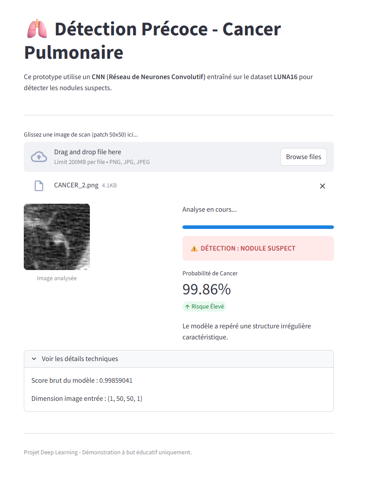

# 🫁 Deep Breath: Détection Précoce de Cancer Pulmonaire via Deep Learning


> **Deep Breath** est une solution d'intelligence artificielle conçue pour assister le diagnostic radiologique en détectant les nodules pulmonaires suspects sur des scanners CT (Tomodensitométrie) avec une précision de 94%.

## 🖼️ Démonstration :




## 🎯 Objectif

Le cancer du poumon est l'une des principales causes de mortalité. La détection précoce via l'analyse de scanners 3D est cruciale mais fastidieuse pour l'œil humain. Ce projet vise à automatiser la classification de nodules (Sain vs Cancer) à partir de "patches" d'images.

## 🧠 Architecture & Performance

Le modèle final (`meilleur_modele.keras`) est un **CNN (Convolutional Neural Network)** optimisé, entraîné à partir de zéro.

* **Performance :** 94.02% de précision sur le jeu de test.
* **Dataset :** LUNA16 (Subset of LIDC-IDRI).
* **Techniques Clés :**

  * **Prétraitement ETL :** Conversion des fichiers bruts `.mhd` en Unités Hounsfield (HU) normalisées.
  * **Data Augmentation Massive :** Multiplication des données x25 (rotations, zooms) pour compenser le déséquilibre des classes.
  * **Batch Normalization :** Stabilisation de l'apprentissage pour surpasser les architectures classiques (VGG16).

### Pourquoi pas le Transfer Learning ?

Nous avons expérimenté avec **VGG16**, mais la précision plafonnait à 65%. Les modèles pré-entraînés sur ImageNet (images naturelles en couleur) se sont révélés inadaptés aux textures médicales fines en niveaux de gris. Une architecture CNN dédiée et légère s'est avérée bien supérieure.

## 🛠️ Installation & Usage

### 1. Cloner le projet

```bash
git clone https://github.com/Sebastien2709/Deep-Breath.git
cd DeepBreath
```

### 2. Installer les dépendances

```bash
pip install -r requirements.txt
```

### 3. Lancer l'application

```bash
streamlit run app.py
```

Ouvrez votre navigateur à l'adresse indiquée (généralement [http://localhost:8501](http://localhost:8501)).

## 📂 Structure du Projet

* `app.py` : L'interface utilisateur Streamlit pour tester le modèle en direct.
* `preprocess_*.py` : Scripts ETL pour extraire les patches depuis les fichiers `.mhd`.
* `train_*.py` : Scripts d'entraînement (Architecture CNN, Augmentation, Callbacks).
* `extract.py` : Utilitaire pour convertir les tensors Numpy en images PNG pour les tests.
* `meilleur_modele.keras` : Le modèle entraîné final.

## ⚠️ Avertissement Médical

Ce projet est une démonstration technique à but éducatif. Il ne constitue pas un dispositif médical certifié et ne doit pas être utilisé pour un diagnostic clinique réel.
